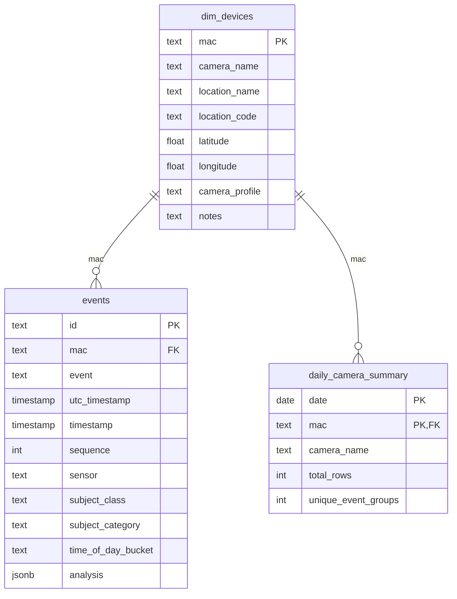

# GrizCam Database Schema Briefing

## Purpose

This document is the database context briefing for agents that need to generate SQL against the GrizCam analytics database. It describes the real schema used by the app, the meaning of each table and column, the important derived semantics, and the query constraints enforced by the application.

## Sources Of Truth

This briefing is based on the checked-in schema and query code, not on live `information_schema` introspection.

- DDL source: [`synthetic/generate_synthetic_events.py`](/Users/kyle/grizcam/synthetic/generate_synthetic_events.py)
- Query catalog and allowed columns: [`apps/api/src/query/catalog.ts`](/Users/kyle/grizcam/apps/api/src/query/catalog.ts)
- Normalization logic used by the API: [`apps/api/src/utils/sql.ts`](/Users/kyle/grizcam/apps/api/src/utils/sql.ts)
- Query validator and workspace restrictions: [`apps/api/src/query/service.ts`](/Users/kyle/grizcam/apps/api/src/query/service.ts)

## Executive Summary

The schema is intentionally small and analytics-oriented. There are 3 public tables:

1. `events`
   Raw event-level fact table. This is the most detailed table and the main source for operational, telemetry, and AI-analysis queries.
2. `dim_devices`
   Camera/device dimension table. This stores one row per camera and should be joined to `events` or `daily_camera_summary` by `mac`.
3. `daily_camera_summary`
   Daily aggregated fact table at grain `(date, mac)`. This is the preferred starting point for trend, KPI, and rollup queries.

## Schema Model

- Database type: PostgreSQL
- Schema used by app: `public`
- Main join key: `mac`
- Event grain: one row per captured image/event row
- Summary grain: one row per camera per day
- Event grouping concept: multiple `events` rows may belong to the same logical event via the `event` column

## Relationship Diagram



## Table Review

### `dim_devices`

Role:
Camera dimension / lookup table.

Grain:
One row per camera device.

Keys:
- Primary key: `mac`

Used for:
- Camera metadata
- Camera filters
- Location and descriptive context

Columns:

| Column | Type | Null | Description |
| --- | --- | --- | --- |
| `mac` | `text` | No | Unique device identifier. Primary join key to fact tables. |
| `camera_name` | `text` | No | Human-readable camera name used widely in UI and queries. |
| `location_name` | `text` | No | Friendly location label. |
| `location_code` | `text` | No | Location code / geospatial identifier. |
| `latitude` | `double precision` | No | Camera latitude. |
| `longitude` | `double precision` | No | Camera longitude. |
| `camera_profile` | `text` | No | Narrative description of the camera’s behavioral/environmental profile. |
| `notes` | `text` | No | Additional free-text operational notes. |

Query notes:
- Use this table when you need stable camera metadata.
- `camera_name` is duplicated into `events` and `daily_camera_summary`, but `dim_devices` is the authoritative device dimension.

### `events`

Role:
Detailed event-level fact table. This is the raw source for telemetry, AI metadata, time-series analysis, and event inspection.

Grain:
One row per event image / event record. Multiple rows can belong to the same logical event group via `event`.

Keys:
- Primary key: `id`
- Foreign key: `mac -> dim_devices(mac)`

Indexes:
- `idx_events_mac_utc` on `(mac, utc_timestamp)`
- `idx_events_timestamp` on `(timestamp)`
- `idx_events_time_bucket` on `(time_of_day_bucket)`
- `idx_events_subject_category` on `(subject_category)`
- `idx_events_camera_timestamp` on `(camera_name, timestamp)`

Columns:

| Column | Type | Null | Description |
| --- | --- | --- | --- |
| `id` | `text` | No | Unique row identifier. |
| `name` | `text` | Yes | Legacy or alternate camera/device label. |
| `mac` | `text` | No | Device key. Joins to `dim_devices`. |
| `event` | `text` | No | Logical event-group identifier. Use for grouping multi-row bursts. |
| `utc_timestamp` | `timestamp` | No | Event timestamp in UTC. |
| `timestamp` | `timestamp` | No | Local wall-clock event timestamp. App treats this as the primary user-facing time. |
| `sequence` | `integer` | No | Sequence number inside an event/burst. |
| `sensor` | `text` | No | Sensor orientation or side, commonly `F`, `B`, `L`, `R`. |
| `location` | `text` | Yes | Raw location text. |
| `latitude` | `double precision` | Yes | Event latitude. |
| `longitude` | `double precision` | Yes | Event longitude. |
| `temperature` | `double precision` | Yes | Temperature reading. |
| `humidity` | `double precision` | Yes | Humidity reading. |
| `pressure` | `double precision` | Yes | Pressure reading. |
| `voltage` | `double precision` | Yes | Voltage telemetry. |
| `bearing` | `integer` | Yes | Directional bearing in degrees. |
| `"batteryPercentage"` | `double precision` | Yes | Legacy camelCase battery field. Compatibility column. |
| `battery_percentage` | `double precision` | Yes | Canonical snake_case battery field. |
| `lux` | `integer` | Yes | Light level. |
| `"heatLevel"` | `integer` | Yes | Legacy camelCase heat field. Compatibility column. |
| `heat_level` | `integer` | Yes | Canonical snake_case heat field. |
| `"fileType"` | `text` | Yes | Legacy camelCase file type field. |
| `file_type` | `text` | Yes | Canonical snake_case file type field. |
| `filename` | `text` | Yes | Media filename. |
| `image_blob_url` | `text` | Yes | Blob storage URL for the image. |
| `uploaded` | `boolean` | Yes | Whether upload completed. |
| `upload` | `text` | Yes | Text upload status / compatibility field. |
| `created` | `timestamp` | Yes | Ingestion/upload creation timestamp. |
| `ai_processed` | `boolean` | Yes | Whether AI processing ran. |
| `ai_timestamp` | `timestamp` | Yes | AI processing timestamp. |
| `json_processed` | `boolean` | Yes | Whether JSON processing completed. |
| `json_timestamp` | `timestamp` | Yes | JSON processing timestamp. |
| `utc_timestamp_off` | `timestamp` | Yes | Offset-adjusted UTC-ish compatibility timestamp used in fallbacks. |
| `timezone` | `text` | Yes | Time zone text. App defaults missing values to `America/Denver`. |
| `tag` | `text` | Yes | Free-text tag / label. |
| `analysis` | `jsonb` | Yes | Structured AI analysis payload. |
| `ai_description` | `text` | Yes | AI description text. Sometimes JSON-like and parsed as fallback analysis. |
| `analysis_title` | `text` | Yes | Flattened analysis title. |
| `analysis_summary` | `text` | Yes | Flattened analysis summary. |
| `subject_class` | `text` | Yes | Specific subject class such as `elk`, `bison`, `hiker`, `vehicle`. |
| `subject_category` | `text` | Yes | Broader category such as `wildlife`, `human`, `vehicle`, `empty_scene`. |
| `time_of_day_bucket` | `text` | Yes | Derived bucket: `morning`, `afternoon`, `evening`, `night`. |
| `camera_name` | `text` | Yes | Human-readable camera name denormalized into the event row. |

Functional column groups:

- Identity and event grouping:
  `id`, `event`, `sequence`
- Device and location:
  `mac`, `camera_name`, `name`, `location`, `latitude`, `longitude`, `sensor`, `bearing`
- Time:
  `timestamp`, `utc_timestamp`, `utc_timestamp_off`, `created`, `ai_timestamp`, `json_timestamp`, `timezone`
- Telemetry:
  `temperature`, `humidity`, `pressure`, `voltage`, `battery_percentage`, `"batteryPercentage"`, `lux`, `heat_level`, `"heatLevel"`
- File/media:
  `file_type`, `"fileType"`, `filename`, `image_blob_url`
- Processing pipeline:
  `uploaded`, `upload`, `ai_processed`, `json_processed`
- AI/semantic enrichment:
  `analysis`, `ai_description`, `analysis_title`, `analysis_summary`, `subject_class`, `subject_category`, `tag`, `time_of_day_bucket`

Important semantics:

- `event` is the logical burst/group key.
  The app often uses `count(distinct event)` as the count of unique event groups.
- `timestamp` is the main business timestamp.
  The app’s normalized timestamp logic falls back through `timestamp`, `utc_timestamp_off`, `utc_timestamp`, `created`, `ai_timestamp`, and `json_timestamp`.
- Some fields exist in both camelCase and snake_case.
  The app prefers snake_case but uses `coalesce` across both forms.
- `analysis` is the preferred structured AI payload.
  If it is null, the app may attempt to parse `ai_description` as JSON and treat that as analysis.

### `daily_camera_summary`

Role:
Pre-aggregated daily rollup table for KPI and trend queries.

Grain:
One row per `(date, mac)`.

Keys:
- Primary key: `(date, mac)`
- Foreign key: `mac -> dim_devices(mac)`

Indexes:
- `idx_daily_camera_summary_date_mac` on `(date, mac)`

Columns:

| Column | Type | Null | Description |
| --- | --- | --- | --- |
| `date` | `date` | No | Local business date derived from `DATE(timestamp)`. |
| `mac` | `text` | No | Camera/device key. |
| `camera_name` | `text` | No | Denormalized camera name. |
| `total_rows` | `integer` | No | Total event rows for the camera on that date. |
| `unique_event_groups` | `integer` | No | Count of distinct `event` values for the day/camera. |
| `wildlife_rows` | `integer` | No | Count of rows where `subject_category = 'wildlife'`. |
| `human_rows` | `integer` | No | Count of rows where `subject_category = 'human'`. |
| `vehicle_rows` | `integer` | No | Count of rows where `subject_category = 'vehicle'`. |
| `empty_scene_rows` | `integer` | No | Count of rows where `subject_category = 'empty_scene'`. |
| `morning_rows` | `integer` | No | Count of rows where `time_of_day_bucket = 'morning'`. |
| `afternoon_rows` | `integer` | No | Count of rows where `time_of_day_bucket = 'afternoon'`. |
| `evening_rows` | `integer` | No | Count of rows where `time_of_day_bucket = 'evening'`. |
| `night_rows` | `integer` | No | Count of rows where `time_of_day_bucket = 'night'`. |
| `avg_temperature` | `double precision` | Yes | Average `temperature` for rows in the group. |
| `avg_lux` | `double precision` | Yes | Average `lux` for rows in the group. |
| `avg_heat_level` | `double precision` | Yes | Average `heat_level` for rows in the group. |
| `avg_battery_percentage` | `double precision` | Yes | Average `battery_percentage` for rows in the group. |

Build logic:

`daily_camera_summary` is rebuilt from `events` by grouping on:

- `DATE(timestamp)`
- `mac`
- `camera_name`

This means:

- It is derived, not independent source-of-truth data.
- If event normalization changes, summary values may need to be recomputed.
- It is best for dashboard-style analysis, not detailed event inspection.

## Canonical Query Semantics

The API does not always query raw columns directly. It applies normalization so that downstream logic remains stable even when source rows are inconsistent.

Agents should prefer the following semantics when writing SQL.

### Canonical Timestamp

Preferred expression:

```sql
coalesce(timestamp, utc_timestamp_off, utc_timestamp, created, ai_timestamp, json_timestamp)
```

Meaning:
- Use `timestamp` first.
- Fall back through compatibility and pipeline timestamps when needed.

### Canonical Camera Name

Preferred expression:

```sql
coalesce(nullif(btrim(camera_name), ''), nullif(btrim(name), ''), mac)
```

Meaning:
- Prefer explicit `camera_name`
- Fall back to `name`
- Fall back to `mac`

### Canonical Event Group

Preferred expression:

```sql
coalesce(nullif(btrim(event), ''), nullif(btrim(id), ''))
```

Meaning:
- Group burst-like rows by `event`
- If `event` is somehow blank, fall back to `id`

### Canonical Battery Percentage

Preferred expression:

```sql
case
  when coalesce(battery_percentage, "batteryPercentage") between 0 and 100
    then coalesce(battery_percentage, "batteryPercentage")
  else null
end
```

Meaning:
- Use the snake_case field if present
- Fall back to camelCase
- Reject impossible values

### Canonical Heat Level

Preferred expression:

```sql
case
  when coalesce(heat_level, "heatLevel") between 0 and 100
    then coalesce(heat_level, "heatLevel")
  else null
end
```

### Canonical File Type

Preferred expression:

```sql
coalesce(nullif(btrim(file_type), ''), nullif(btrim("fileType"), ''))
```

### Canonical Subject Class / Category

Best practice:
- Prefer stored `subject_class` and `subject_category` if present.
- Be aware the app can derive them from analysis text and JSON when missing.
- `subject_category` maps to broad groups used heavily in analytics:
  - `wildlife`
  - `human`
  - `vehicle`
  - `empty_scene`
  - occasionally `threat`

Common `subject_class` values from synthetic generation:
- `elk`
- `bison`
- `deer`
- `wolf`
- `bear`
- `fox_coyote`
- `bird`
- `empty_landscape`
- `hiker`
- `ranger`
- `vehicle`

### Canonical Time Of Day Bucket

Stored values are usually one of:
- `morning`
- `afternoon`
- `evening`
- `night`

If missing, the app derives them from the normalized timestamp hour:

- `06:00-11:59` -> `morning`
- `12:00-16:59` -> `afternoon`
- `17:00-21:59` -> `evening`
- otherwise -> `night`

## Recommended Join Paths

### Events To Device Metadata

```sql
select e.id, e.timestamp, d.camera_name, d.location_name
from events e
join dim_devices d on d.mac = e.mac
```

Use when:
- You need stable device metadata
- You want location or profile context

### Daily Summary To Device Metadata

```sql
select s.date, s.camera_name, d.location_name, s.unique_event_groups
from daily_camera_summary s
join dim_devices d on d.mac = s.mac
```

Use when:
- You want trends plus camera context

Avoid:
- Joining `events` to `daily_camera_summary` unless you are very explicit about grain, because it is easy to duplicate summary data across many event rows.

## Query Recommendations For Agents

### Prefer `daily_camera_summary` for:

- Daily trends
- KPI rollups
- Camera comparisons over time
- Top cameras by volume
- Subject/time-of-day composition at daily grain

### Prefer `events` for:

- Recent event inspection
- Telemetry analysis
- AI processing lag analysis
- Text search over `analysis_title` and `analysis_summary`
- Sensor, sequence, file, upload, and pipeline debugging
- Event-group level analysis using `event`

### Prefer `dim_devices` for:

- Camera inventory
- Camera metadata lookup
- Geospatial context
- Descriptive filtering context

## Query Guardrails Enforced By The App

When using the app’s query workspace, SQL is restricted.

Allowed:
- Read-only `SELECT`
- `WITH`
- `UNION` / `UNION ALL`
- Approved scalar functions such as `count`, `avg`, `min`, `max`, `sum`, `date_trunc`, `round`, `coalesce`, `lower`, `upper`, `abs`, `ceil`, `ceiling`, `floor`, `greatest`, `least`, `nullif`
- `ORDER BY` on approved base columns
- `ORDER BY` on repeated safe computed expressions
- `ORDER BY` on SELECT-list aliases when the underlying expression is built only from approved columns and approved functions
- `ORDER BY` by valid select-list ordinals such as `order by 2 desc`

Blocked:
- Non-`SELECT` statements
- Access to non-`public` schemas
- `information_schema`
- `pg_catalog`
- Window functions and within-group syntax

Special restriction:
- `SELECT *` is allowed, including on `events`, but agents should still prefer explicit columns when they only need a narrower result.

Remaining restrictions:
- Alias resolution is local to the same `SELECT` scope.
- Derived aliases do not bypass blocked schemas, blocked functions, or relation allowlists.
- `ORDER BY` aliases must resolve to a safe projection already present in the same `SELECT` list.

Default limits:
- General default limit: `100`
- General max limit: `1200`
- `dim_devices` default limit: `50`

## Common Analytical Features Supported By The Schema

The schema directly supports:

- Event volume analysis
- Camera utilization trends
- Wildlife vs human vs vehicle composition
- Time-of-day distribution
- Temperature, lux, voltage, heat, humidity, pressure telemetry analysis
- Upload and AI processing pipeline monitoring
- AI title/summary search and semantic summaries
- Burst/event-group analysis via `event`
- Device-level mapping and camera profile enrichment

## Caveats And Gotchas

1. `events` contains both raw compatibility fields and normalized analytics fields.
   Examples: `battery_percentage` vs `"batteryPercentage"`, `heat_level` vs `"heatLevel"`, `file_type` vs `"fileType"`.

2. `camera_name` exists in more than one table and may also overlap with `name`.
   For stable joins, join on `mac`, not `camera_name`.

3. `daily_camera_summary.unique_event_groups` is not the same as `total_rows`.
   It represents `count(distinct event)`, not row count.

4. `daily_camera_summary` is derived from `events`.
   If a query needs the freshest or most detailed truth, use `events`.

5. Null handling matters.
   Many enrichment and telemetry fields are nullable, so `coalesce`, explicit filtering, and null-safe aggregates are important.

6. Stored timestamps are plain `timestamp`, not `timestamptz`.
   Treat `timestamp` as the local business event time used by the app.

7. `analysis` is structured JSONB, but `ai_description` may sometimes hold JSON-like text.
   The app parses that as fallback analysis when possible.

## Safe Starting Queries

### Recent event inspection

```sql
select
  timestamp,
  camera_name,
  event,
  subject_category,
  analysis_title
from events
order by timestamp desc
limit 50;
```

### Daily camera trend

```sql
select
  date,
  camera_name,
  unique_event_groups,
  avg_temperature,
  avg_lux
from daily_camera_summary
order by date desc, camera_name asc
limit 30;
```

### Top cameras by grouped event volume

```sql
select
  camera_name,
  sum(unique_event_groups) as total_event_groups
from daily_camera_summary
group by camera_name
order by total_event_groups desc
limit 10;
```

### Category counts from raw events

```sql
select
  subject_category,
  count(*) as event_count
from events
where subject_category is not null
group by subject_category
order by event_count desc
limit 20;
```

## Agent Guidance

If an agent is choosing a table:

1. Use `daily_camera_summary` if the question is trend-oriented and daily grain is enough.
2. Use `events` if the question needs row detail, telemetry, AI fields, pipeline timing, or event grouping.
3. Join to `dim_devices` on `mac` when location or descriptive camera context is needed.

If an agent is choosing a count:

1. Use `count(*)` for row count.
2. Use `count(distinct event)` for logical event-group count.

If an agent sees both snake_case and camelCase variants:

1. Prefer snake_case in output.
2. Use `coalesce` across both forms when correctness matters.
